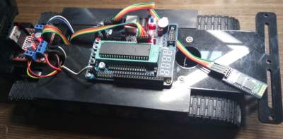

# Bluetooth Tank module for Android



This library can be used to connect to this tank using bluetooth.

Also this is an example this is a very small library doing bluetooth
communication on Android.

Simple demo @ [bluetoothtank-demo].

Demo with touchjoystick @ [mbtjoy-demo].

## Usage

1. Pair with the tank using your phone settings app, remember the name.
2. Import the module into your project
3. code

```java
BluetoothTank mBTTank = new BluetoothTank("paired_name", listener);
mBTTank.start();

mBTTank.commandSetSpeed(1); // 1..3, to be send when needed

// or

mBTTank.commandSetSpeedNow(1); // send it now

mBTTank.commandUp();
mBTTank.commandDown();
mBTTank.commandLeft();
mBTTank.commandRight();
mBTTank.commandStop();
```

## History

The provider of the tank didn't want to give the protocol, he said we should
code our own firmware... as it had something already installed, found the
protocol on some files provided, it is a very simple text protocol.

[bluetoothtank-demo]: https://github.com/aaronps/bluetoothtank-demo.git
[mbtjoy-demo]: https://github.com/aaronps/mbtjoy-demo.git
